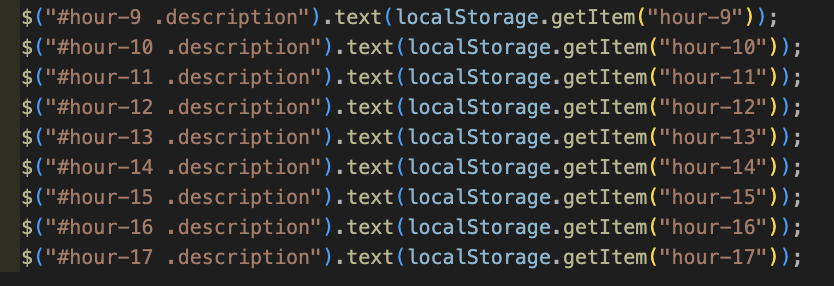

# Daily--Work-Day-Scheduler

## Goal

To take the given starter code and use the jQuery API to build a fully interactive daily work scheduler. The over arching idea of this project was to test a new found skill in building a code base with jQuery and using the local storage set in the users web browser to store information for later use. The website is desgined to track the current time of the day and display an easy to understand Ui. The schedule will auto-matically color code itself depending on what time of day it is. If the time has past, the box will grey out. If it is the current hour, it will be displayed in red and any blocks that are set in the future will be displayed in green. 

## User Story

The given User Story is as follows:

    AS AN employee with a busy schedule
    I WANT to add important events to a daily planner
    SO THAT I can manage my time effectively

## Acceptance Criteria

    GIVEN I am using a daily planner to create a schedule
        WHEN I open the planner
        THEN the current day is displayed at the top of the calendar
        WHEN I scroll down
        THEN I am presented with time blocks for standard business hours
        WHEN I view the time blocks for that day
        THEN each time block is color-coded to indicate whether it is in the past, present, or future
        WHEN I click into a time block
        THEN I can enter an event
        WHEN I click the save button for that time block
        THEN the text for that event is saved in local storage
        WHEN I refresh the page
        THEN the saved events persist

## Assets

The Following image demonstrates the landing page's desired layout:

## How it works
As stated above, the purpose of this project was to test a new skill in jQuery and using the browsers local stroage. Do to this, I first simply setted the time and date using the API, dayjs, which is a very help tool when needing to display the time, day, month, or year. It is a really indepth and well documentd api that has many uses! Following that was actually grabbing the user input. I used the jQuery method of .attr() to first assign the id element of each section and used document traversal to acesse the actually text area of each block. After that I added an .on() click event to the save button and within the function set the key and value of the hour block in use and the input from the user to local stroage. 

After that was acomplished, I simply refrenced each text area and set the corresponidng text value of each to the value set in the local storage and set them in the global scope in-order to have the users past input disply each time the website is accessed. 

Lastly, was to set up a function that would compare the hour value from each div's id and compare it to the current hour delared in the global scope. I had to declare a varible in the local scope of the function with refrence to the each divs id value and split the "hour - " from the string and have the numeric value left. Once I had that set, i wrote an if statement to compare the current hour to the id hour and remove an class that was not true and apply the desired class to change the back ground of the text area. 

## Challenges
The biggest challenge I had during this project was getting the value of the useres input to presiest with each load in. trying to find the solution was more diffcult than I had previouly outlined in my pesudocode. Beliveing to just needing to set the value of the text area to the value saved in local stroage waa not clicking exactly right. I had to do a deepdive into local stroage and figure out what was wrong, with the code I had written and why it wasn't being dispalyed properly. Luckly, using the website [Mdm Web Docs](https://developer.mozilla.org/en-US/docs/Web/API/Window/localStorage) and [W3Schools](https://www.w3schools.com/jsref/prop_win_localstorage.asp) was helpful in setting me to the right path. 

## Testing the solution
When using something new or not as well understood, I find it very helpful to just console.log every line of code to see what it is actually acessing. Esspically with DOM traversal is being used. It can quicklhy become overwhelming to code when you get serval errors to come back after writing 30 lines of code. I would recommedn to any new developers to just console.log() everything to avoid massive breaks and erros poping up!
## Take Aways
The big take away from this project was just how helpful and quickly you can wrtie javascript using the jQueary API and not just jQueary, but any API that is well documented and estalipshed in the community of web developers.It can save a lot of time and energy when working on a new algortium. 
## Links

This links to the live page:
https://mmount98.github.io/Daily--Work-Day-Scheduler/